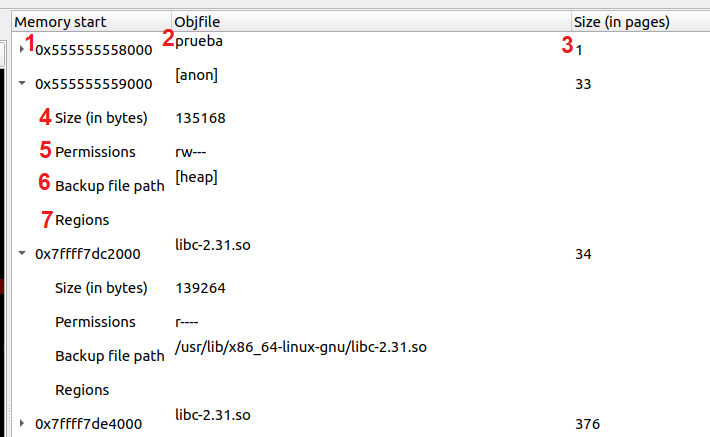

# Herramienta de depuración con representación de regiones de memoria

Este proyecto es una extensión para una interfaz gráfica de usuario (GUI, por sus siglas en inglés) de depuración, con el objetivo de añadir funcionalidades relacionadas con las regiones de memoria. El depurador escogido ha sido GDB, que funciona para varios lenguajes de programación. En concreto, la extensión se ha centrado en los lenguajes C y C++, y se ha añadido a la GUI [Gede](https://gede.dexar.se/), desarrollada por Johan Henriksson ([johan@dexar.se](mailto:johan@dexar.se)).

La extensión permite visualizar el mapa de memoria del proceso que se está depurando, incluyendo información sobre los tamaños de cada región de memoria, sus posiciones en memoria virtual, el fichero de respaldo de cada una y los permisos de acceso del proceso.

<figure>

<figcaption align=center><b>Figura 1: extensión desarrollada (remarcada en rojo)</b></figcaption>

</figure>

La extensión funciona mediante combinando las salidas comandos de GDB (<i>info proc mappings</i> e <i>info files</i>) y llamadas al sistema (<i>pmap</i>) para acabar ofreciendo toda la información junta y de una manera simple y cómoda.

## <b>Instalación</b>
---

Las instrucciones para compilar Gede se incluyen [aquí](./gede-2.18.1/README). No se necesitan pasos adicionales para instalar la extensión.

## <b>Uso</b>
---

La extensión muestra los valores más importantes del mapa de memoria.

El número hexadecimal bajo la columna de nombre ``Memory start`` (1) señala el comienzo de la región de memoria mapeada. A su lado, ``Objfile`` (2) representa el nombre del fichero de respaldo. ``Size (in pages)`` (3) representa el tamaño de esa región de memoria en páginas.

Cuando presionamos el triángulo a la izquierda de la dirección inicial de memoria, se despliega la información relativa al bloque de memoria. En ese momento se pueden leer el ``tamaño en bytes`` (4), sus ``permisos de acceso`` (5), la ``ruta completa del fichero de respaldo`` (6) y otro desplegable con las ``regiones`` incluidas en ese espacio de memoria (7), vacío para este ejemplo.

<figure>

<figcaption align=center><b>Figura 2: elementos del mapa de memoria</b></figcaption>

</figure>