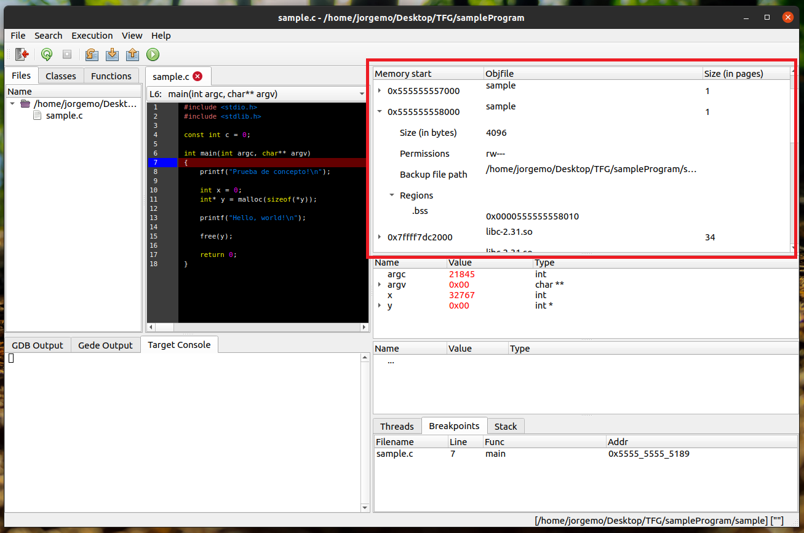

# Herramienta de depuración con representación de regiones de memoria

Este proyecto es una extensión para una interfaz gráfica de usuario (GUI, por sus siglas en inglés) de depuración, con el objetivo de añadir funcionalidades relacionadas con las regiones de memoria. El depurador escogido ha sido GDB, que funciona para varios lenguajes de programación. En concreto, la extensión se ha centrado en los lenguajes C y C++, y se ha añadido a la GUI [Gede](https://gede.dexar.se/), desarrollada por Johan Henriksson ([johan@dexar.se](mailto:johan@dexar.se)).

La extensión permite visualizar el mapa de memoria del proceso que se está depurando, incluyendo información sobre los tamaños de cada región de memoria, sus posiciones en memoria virtual, el fichero de respaldo de cada una y los permisos de acceso del proceso.

<figure>

<figcaption alignment="center"><b>Extensión desarrollada (remarcada en rojo)</b></figcaption>

</figure>

 

<!-- ## Ejemplos de uso -->
